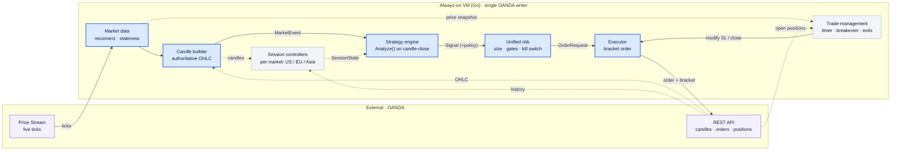
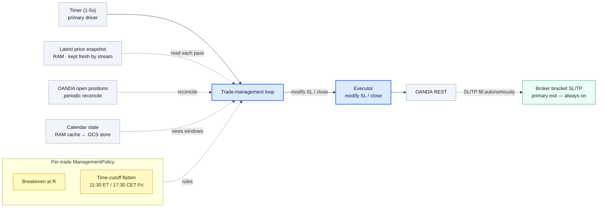

# Architecture Diagrams (Mermaid)

Editable source-of-truth diagrams for the revised design in
[`target-architecture.md`](./target-architecture.md).

**Color key:** blue = sync hot path · slate = VM support · violet = external ·
magenta = async sidecars · green = data lake · amber = signal/risk.
Solid arrows = synchronous in-process; dotted arrows = async or in-RAM state.

---

## 1. System overview — the hot path (money path)

Only the components that decide and place trades. Everything runs **in-process on the
VM**; the only network calls on this path are to OANDA. Supporting services (logging,
analytics, calendar, data lake) are in diagram 1b and can never block a trade.



Blocks, in order of the flow:
- **Price Stream / REST (OANDA)** — live ticks (stream) and authoritative candles,
  order placement, and open-position reads (REST).
- **Market data** — consumes the stream; handles reconnect and staleness-halt; keeps
  the latest price per instrument in RAM.
- **Candle builder** — turns ticks into candles, confirmed against REST OHLC.
- **Session controllers** — per-market context (opening range, ATR, VWAP, RSI); see 2b.
- **Strategy engine** — runs `Analyze()` on candle-close, emits a `Signal`; see 2.
- **Unified risk** — sizes the signal, applies gates + kill switch + concurrency guard.
- **Executor** — the single OANDA writer; places the bracketed order.
- **Trade-management** — timer loop that adjusts live trades (breakeven, exits); see 3.

---

## 1b. Supporting services (off the hot path)

Async logging, analytics, notifications, the economic-calendar poll, and the data lake.
None of this is on the trade-decision path; if any of it is slow or down, trading
continues (the calendar is treated fail-safe).

```mermaid
flowchart LR
  MD["Market data<br/>(VM)"]
  EXEC["Executor<br/>(VM)"]
  SESS["Session controllers<br/>(VM)"]
  RISK["Unified risk<br/>(VM)"]
  CALAPI["Economic calendar API<br/>Finnhub / FMP"]
  SCHED["Cloud Scheduler<br/>every 15-30 min"]
  CALSTORE["Calendar state store<br/>GCS object (JSON) · durable"]
  TG["Telegram"]

  subgraph CR["Async sidecars · Cloud Run + Pub/Sub"]
    direction TB
    PUB["Async publisher<br/>events + tick buffer"]
    PS["Pub/Sub<br/>at-least-once"]
    BQLOG["BigQuery logger"]
    KPI["Analytics / KPI"]
    NOTIF["Telegram notifier"]
    POLL["Calendar poller<br/>stateless · scheduled"]
  end

  subgraph LAKE["Data lake · zero-cost"]
    direction LR
    GCS["GCS<br/>tick batches · TTL"]
    BQ["BigQuery<br/>ticks · trade_ledger"]
    ML["ML / KPIs<br/>offline"]
  end

  MD -. ticks .-> PUB
  EXEC -. "trade events" .-> PUB
  PUB -. events .-> PS
  PUB -. "tick batches" .-> GCS
  PS -. .-> BQLOG
  PS -. .-> KPI
  PS -. .-> NOTIF
  NOTIF -. .-> TG
  SCHED -. trigger .-> POLL
  CALAPI -. fetch .-> POLL
  POLL -- "write state" --> CALSTORE
  CALSTORE -. "read → RAM cache" .-> SESS
  CALSTORE -. "read → RAM cache" .-> RISK
  BQLOG -. append .-> BQ
  GCS -- load --> BQ
  BQ -- read --> ML

  classDef supp fill:#f1f5f9,stroke:#94a3b8,color:#0f172a;
  classDef async fill:#fdf4ff,stroke:#c026d3,color:#2a1030;
  classDef data fill:#ecfdf5,stroke:#059669,color:#052e22;
  classDef ext fill:#f3f0ff,stroke:#7c3aed,color:#1e1b2e;

  class MD,EXEC,SESS,RISK supp;
  class PUB,PS,BQLOG,KPI,NOTIF,POLL,SCHED async;
  class GCS,BQ,ML,CALSTORE data;
  class CALAPI,TG ext;
```

Two write paths into BigQuery: the **logger** appends the trade ledger directly; **ticks**
land in GCS and are batch-loaded.

**Calendar state is persisted, not pushed.** Cloud Scheduler triggers the stateless
poller every 15–30 min; the poller fetches the economic calendar and **writes a durable
JSON object** (`calendar-state.json` in GCS — the poller holds nothing between runs). The
VM reads that object on its own timer into a small **RAM cache**, which the session
controllers, risk module, and management loop consult. This survives poller cold-starts
and VM restarts, and is **fail-safe**: if the object is missing or its `as_of` timestamp
is stale, the VM treats "event imminent" (blocks new entries / tightens stops) rather
than trading blind. (Firestore is an alternative store; GCS is chosen for zero-cost reuse.)

### State recovery (on boot)

The VM holds live state in RAM only; on startup it rebuilds from OANDA (no separate
datastore — OANDA is the source of truth):

```text
OANDA REST ─▶ State recovery ─┬─▶ open trades   → executor / trade-management
                             └─▶ session ranges → session controllers
```

---

## 2. Strategy execution — how a tick becomes an order

```mermaid
flowchart LR
  TICK["Candle-close event<br/>per instrument"]
  ROUTER["Strategy router<br/>dispatch to ONE match"]
  STATE["SessionState (RAM)<br/>from this market's controller"]

  subgraph STRAT["Strategy registry — Analyze() is pure"]
    direction TB
    US["US_Sweep"]
    EU["EU_Breakout"]
    ASIA["Asia_MeanRev"]
  end

  SIGNAL["Signal<br/>side · entry · SL · TP · policy"]
  NOOP["nil — no setup<br/>(common)"]
  RISK["Unified risk<br/>size · gates · kill switch<br/>1 trade / index"]
  REJECT["Rejected → log"]
  EXEC["Executor<br/>bracket · client-order-id"]
  OANDA["OANDA REST"]

  TICK -- MarketEvent --> ROUTER
  ROUTER -- "by instrument" --> US
  ROUTER --> EU
  ROUTER --> ASIA
  STATE -. SessionState .-> US
  STATE -. .-> EU
  STATE -. .-> ASIA
  US -- Signal --> SIGNAL
  EU --> SIGNAL
  ASIA --> SIGNAL
  ASIA -. nil .-> NOOP
  SIGNAL --> RISK
  RISK -. blocked .-> REJECT
  RISK -- "OrderRequest (sized)" --> EXEC
  EXEC -- "order + bracket" --> OANDA

  classDef hot fill:#dbeafe,stroke:#2563eb,stroke-width:2px,color:#0b1b34;
  classDef strat fill:#eef2ff,stroke:#6366f1,color:#1e1b2e;
  classDef sig fill:#fef9c3,stroke:#ca8a04,stroke-width:2px,color:#3b2f05;
  classDef muted fill:#f1f5f9,stroke:#94a3b8,color:#0f172a;

  class TICK,ROUTER,EXEC hot;
  class US,EU,ASIA strat;
  class SIGNAL,RISK sig;
  class STATE,NOOP,REJECT,OANDA muted;
```

The router dispatches each event to **exactly one** strategy (the instrument's match);
the three boxes show the registry, not parallel execution. Most `Analyze()` calls
return `nil` (no setup) — only a satisfied entry matrix yields a `Signal`.

---

## 2b. Session controllers — one per market

There is **one controller per market**, each on its own session clock, each producing
its own `SessionState` for the matching strategy. They are independent: the US
controller is idle while Europe trades, and vice-versa.

```mermaid
flowchart LR
  CANDLES["Candle builder"]
  REST["OANDA REST<br/>historical candles"]

  subgraph CTRL["Session controllers (per market)"]
    direction TB
    USC["US controller<br/>active 09:30-16:00 ET<br/>locks 09:30-09:45 range · RSI · volMA"]
    EUC["EU controller<br/>active 08:00-17:30 CET<br/>08:00-09:00 range · 14d ATR · VWAP"]
    ASC["Asia controller<br/>active Tokyo session<br/>overnight gap · Bollinger"]
  end

  subgraph STRATS["Strategies"]
    direction TB
    US["US_Sweep"]
    EU["EU_Breakout"]
    ASIA["Asia_MeanRev"]
  end

  CANDLES -. "ticks + closed candles" .-> USC
  CANDLES -. .-> EUC
  CANDLES -. .-> ASC
  REST -. "pre-session history" .-> EUC
  REST -. .-> ASC
  USC -. "SessionState" .-> US
  EUC -. .-> EU
  ASC -. .-> ASIA

  classDef ctrl fill:#f1f5f9,stroke:#94a3b8,color:#0f172a;
  classDef strat fill:#eef2ff,stroke:#6366f1,color:#1e1b2e;
  classDef muted fill:#f8fafc,stroke:#cbd5e1,color:#0f172a;

  class USC,EUC,ASC ctrl;
  class US,EU,ASIA strat;
  class CANDLES,REST muted;
```

### Role & lifecycle (per controller)

- **Schedule-aware:** knows its market hours in IANA tz (`America/New_York`,
  `Europe/Berlin`/`London`, `Asia/Tokyo`) with DST + trading-holiday calendar; only
  activates during its own session (efficiency + correctness).
- **Records the daily parameters** its strategy needs (US: 09:30-09:45 range + RSI +
  volMA; EU: 08:00-09:00 range + 14-day ATR + running VWAP; Asia: overnight gap +
  Bollinger) — held in RAM.
- **Daily lifecycle:** open → record → **lock** boundaries at the cutoff (09:45 ET /
  09:00 CET) → serve `SessionState` through the trade window → reset next day.
- **Inputs:** candle builder (live ticks + closed candles), OANDA REST (pre-session
  history: EU ATR, Asia gap, and range rebuild on boot). **Output:** read-only
  `SessionState` to its strategy's `Analyze()`.

Mapping (instrument → controller → strategy) is 1:1 per market, e.g.
`NAS100_USD → US controller → US_Sweep`, `DE40_EUR → EU controller → EU_Breakout`.

### Connections (summary)

Inputs (into each controller):
1. **Clock + trading-holiday calendar → controller** — when to activate / lock / reset
   in IANA tz (DST + holidays); skips holidays and half-days.
2. **Candle builder → controller** (live) — ticks + closed candles to accumulate the
   opening range, running VWAP, and volume MA during the session.
3. **OANDA REST historical candles → controller** (pre-session + recovery) — EU 14-day
   ATR, Asia overnight gap (prior close), and range rebuild on boot.

Output (out of each controller):
4. **Controller → its strategy's `Analyze()`** — a read-only `SessionState` snapshot
   (locked ranges, ATR, VWAP, RSI/volMA, gap). The only thing it hands downstream.

```text
Clock + holidays ┄→ ┐
Candle builder   ┄→ ├─ Session controller (US | EU | Asia) ┄SessionState┄→ Strategy.Analyze()
OANDA REST hist  ┄→ ┘
```

Two properties to remember:
- **Distiller, not decider:** the controller only computes/holds context — it never
  emits signals or touches orders. `Analyze()` reads its output.
- **Per-market and independent:** each controller is fed the same way but only for its
  own instruments and only during its own session (the US controller is idle while
  Europe trades); their state never mixes.

---

## 3. Trade-management loop (exits)

Runs independently of `Analyze()`, driven by a **timer** (not ticks). Primary exits
are the broker brackets (survive VM death); this loop only applies dynamic changes,
driven by the per-trade `ManagementPolicy` attached at entry. Pure trailing is
offloaded to the broker (`trailingStopLossOnFill`), so the loop handles breakeven +
time-cutoff + news flatten.



### Why the trade-management loop exists

OANDA brackets (`stopLossOnFill` / `takeProfitOnFill`) only cover the **static**
exit — a fixed stop and target set at entry that never change. The management loop
exists for the **dynamic** behaviours the broker cannot express on its own, all of
which are required by the strategy docs:

| Behaviour | Broker bracket alone? | Needs loop? |
|---|---|---|
| Fixed SL at entry | yes | — |
| Fixed TP at entry | yes | — |
| Auto-close if VM is down | yes | — |
| Breakeven shift: SL→entry once profit ≥ 1R (US §4, EU §4) | no | yes |
| Time-cutoff flatten: 11:30 ET / 17:30 CET Fri (US §5, EU §5) | no | yes |
| News flatten: stops→breakeven before high-impact events (EU §5) | no | yes |
| Pure trailing stop (fixed distance) | yes (`trailingStopLossOnFill`) | optional |

Why the broker can't do the dynamic parts:
- **Breakeven is not a trailing stop.** A trailing stop follows price by a constant
  distance; breakeven is a one-time conditional ("when profit ≥ 1R, set SL to the
  exact entry price, then stop"). OANDA has no "on condition, set stop to price X"
  rule, so the loop must detect it and send a modify.
- **Time-cutoffs don't exist in brackets.** Order GTD expiry cancels an *order*, it
  does not close an open *position* at market. The loop's timer does that.
- **News-driven changes** depend on the external economic calendar, which only our
  system knows about.

Division of labour: **bracket = always-on safety net (survives crashes); loop =
active adjustments on top (breakeven, time-cutoff, news, optional trailing) plus
reconciliation/recovery.** Delete the loop and trades still exit safely — you just
lose the strategies' edge-enhancing behaviours.

### OANDA order capabilities (bracket + trailing)

Entry, stop, and target are placed in **one atomic** `POST /v3/accounts/{id}/orders`
call; when the entry fills, OANDA auto-creates the linked SL/TP on the trade:

```json
{
  "order": {
    "type": "MARKET",
    "instrument": "NAS100_USD",
    "units": "5",
    "timeInForce": "FOK",
    "positionFill": "DEFAULT",
    "takeProfitOnFill":       { "price": "18450.0" },
    "stopLossOnFill":         { "price": "18380.0" },
    "trailingStopLossOnFill": { "distance": "25.0" },
    "clientExtensions":       { "id": "us-sweep-20260717-0950" }
  }
}
```

- `stopLossOnFill` — accepts `price` or `distance`.
- `takeProfitOnFill` — absolute `price` only (executor computes it from the Signal).
- `trailingStopLossOnFill` — a broker-native trailing stop by `distance`; this can
  offload a *pure* trailing rule to OANDA (maps to `ManagementPolicy.Trail`).
- `clientExtensions.id` — idempotency key (dedupes retried requests).
- SL/TP prices must respect the instrument's price precision and minimum-distance
  rules or the order is rejected (instrument-metadata layer).

Note: even with `trailingStopLossOnFill` available, breakeven and time/news exits
still require the loop — a trailing stop cannot express them.

### Connections (inputs → outputs)

- **`Timer → MGR`** — the only thing that starts a pass. A `time.Ticker` (1–5s).
  Guarantees time-based rules fire even in dead-quiet markets. No external dependency.
- **`Latest price snapshot ┄read┄→ MGR`** — a *read* of shared RAM (`map[instrument]price`
  kept fresh by the stream), not a per-tick event. Supplies the price for the
  breakeven check. The loop samples it once per pass.
- **`OANDA open positions ┄reconcile┄→ MGR`** — source of truth for what's open, via
  `GET /openTrades`. Polled less often than the timer (e.g. every 15–30s) and refreshed
  after any modify/close. Provides trade id, entry, current SL; a vanished trade means
  the bracket already closed it → drop it.
- **`Calendar state ┄news windows┄→ MGR`** — cached "next high-impact event per region"
  written by the poller sidecar. Fail-safe: stale/unknown ⇒ treat as event imminent.
- **`ManagementPolicy ┄rules┄→ MGR`** — per-trade `BreakevenAtR` + `TimeCutoff`, attached
  at entry (trailing lives at the broker). Keeps strategies pure.
- **`MGR → Executor → OANDA REST`** — decisions go through the single writer: modify stop
  (`PUT /trades/{id}/orders`) or close (`PUT /trades/{id}/close`), with an idempotency key.

### How one pass works

```text
on each timer tick:
  for each openTrade (from last reconcile):
      price   = snapshot[trade.instrument]                 # read RAM
      profitR = (price - trade.entry) / trade.riskDistance # sign per direction

      if now >= policy.TimeCutoff:                          # time-cutoff
          EXEC.close(trade.id); continue
      if calendar.minsToHighImpact(trade.instrument) <= 30: # news flatten
          if trade.SL != trade.entry: EXEC.modifyStop(trade.id, trade.entry)
      if profitR >= policy.BreakevenAtR:                    # breakeven
          if trade.SL != trade.entry: EXEC.modifyStop(trade.id, trade.entry)
  periodically refresh openTrades
```

Two correctness properties:
- **Level-triggered, not edge-triggered:** it checks state ("is the stop already at
  entry?") rather than events ("did we just cross 1R?"), so a missed pass, restart, or
  laggy price never skips the action — the next pass still applies it.
- **Idempotent + reconciled:** re-issuing "move SL to entry" when it's already there is a
  no-op; a trade closed by the bracket disappears from `openTrades` and is dropped.

### Does it need ticks?

**No.** The timer drives it, price is a cached read, positions/calendar are periodic
reads, policy is per-trade data. The stream keeps the price snapshot fresh in the
background, but the loop is a scheduled reconciler — so it keeps working through brief
stream hiccups (reads a slightly stale price; the broker bracket protects regardless).
Ticks would only buy sub-second breakeven precision, which candle-based strategies do
not need; even then it would read the shared in-memory tick, not a second subscription.

### Where calendar events come from

Two distinct calendars. Neither is a free-flowing event — both resolve to **durable
state** the VM reads (fail-safe if stale/missing):

- **Economic events** (CPI, NFP, FOMC, ECB) — the news filter. Flow:
  `Cloud Scheduler → stateless poller → fetch provider → write calendar-state.json (GCS)
  → VM reads into RAM cache`. Provider is behind a swappable interface; free-tier
  candidates: **Finnhub** or **Financial Modeling Prep**; alternatives: Trading Economics
  (paid), Forex Factory XML (unofficial), OANDA Labs (no stability guarantee). Default:
  Finnhub free tier. Store: GCS object (Firestore is an alternative). The VM caches the
  object in RAM and re-reads on a timer; a missing/stale `as_of` ⇒ treat event imminent.
- **Trading holidays / half-days** — for session logic (so "market open" doesn't fire on
  a holiday or during 13:00 ET early closes). Kept as a **checked-in config file**
  (per coding guidelines), validated yearly against exchange calendars (CME / Eurex / LSE).
  Already durable; no external dependency, no failure mode.

Status: mechanism designed; the specific economic-calendar provider is not yet locked in.
Default assumption is Finnhub free tier behind an interface.

---

## 4. Payloads / data contracts

Proposed Go shapes (no code exists yet); field sources noted.

```go
// OANDA WebSocket unit (GCP services.md → historical_ticks)
type Tick struct {
    Instrument string
    Time       time.Time // UTC
    Bid, Ask   float64
    Volume     int64     // tick volume
    Mid        float64   // (bid+ask)/2
    Spread     float64   // ask-bid → spread_variance
}

// 5-min OHLCV candle (authoritative from REST, real-time from stream)
type Candle struct {
    Time                   time.Time
    Open, High, Low, Close float64
    Volume                 int64
}

// Handed to the router; entry decision fires only when Closed = true
type MarketEvent struct {
    Instrument string
    Now        time.Time // instrument market tz (IANA)
    LastTick   Tick
    Candles    []Candle  // sliding window, ≤50 (Market wise strategies.md)
    Closed     bool      // a candle just closed → decision trigger
}

// Per-day computed context, RAM only, read-only to strategies.
// NOTE: no daily-trade flag here — concurrency is a risk-module concern (below).
type SessionState struct {
    InitialHigh, InitialLow float64 // US 09:30–09:45 ET
    OpeningHigh, OpeningLow float64 // EU 08:00–09:00 CET
    DailyATR                float64 // EU 14-day
    VWAP                    float64 // EU running
    RSI14                   float64 // US
    VolMA20                 float64 // US 20-period volume MA
    GapPct                  float64 // Asia opening gap
}

// Strategies are pure: window + state in → Signal or nil out.
type Strategy interface {
    Analyze(ev MarketEvent, st SessionState) *Signal // nil = no setup
}

// How the shared management loop should handle THIS trade after entry.
type ManagementPolicy struct {
    BreakevenAtR float64   // move SL→entry once profit ≥ this ×risk
    TimeCutoff   time.Time // unconditional flatten (instrument tz)
    Trail        string    // optional trailing rule id ("" = none)
}

// Strategy output: price intent + management policy. NOT sized.
type Signal struct {
    Instrument string
    Strategy   string           // "US_Opening_Sweep"
    Direction  string           // "LONG" | "SHORT"
    EntryPrice float64
    StopLoss   float64
    TakeProfit float64
    Policy     ManagementPolicy // executed later by the management loop
    Reason     string           // audit: which conditions fired
    At         time.Time
}

// Risk output: concrete, sized, idempotent.
// Risk rejects if an open position for Instrument already exists
// (one concurrent trade per index, derived from OANDA open trades).
type OrderRequest struct {
    Instrument    string
    Units         int64   // signed
    StopLoss      float64 // bracket
    TakeProfit    float64
    ClientOrderID string  // idempotency key
}
```

---

## 5. Resolved decisions

- **Trigger split:** `Analyze()` fires on candle-close only; a separate
  trade-management loop handles tick/timer management (diagram 3).
- **Exits:** broker brackets are the primary exit; the generic management loop
  applies dynamic changes driven by a per-trade `ManagementPolicy`. Strategies
  stay pure and emit no ongoing exit signals.
- **Concurrency guard:** one concurrent trade per index, enforced in the unified
  risk module and derived from OANDA open trades (durable across restarts).
  Pure concurrency for **all** markets — no daily/per-session trade cap.
- **EU daily cap dropped (intentional):** the EU strategy's "one execution per
  index per day" rule (`Europe market strategy.md` §5) is **not** implemented.
  Same-day re-entry after a stop-out is allowed. Whipsaw exposure is instead
  bounded by the portfolio-level controls (max daily loss, consecutive-loss
  circuit breaker) in the unified risk module.
