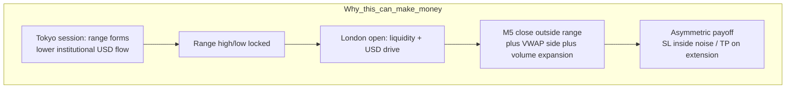
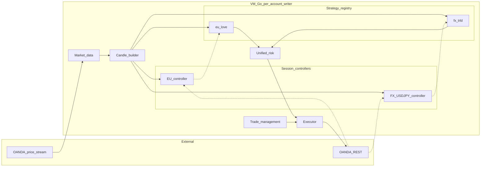
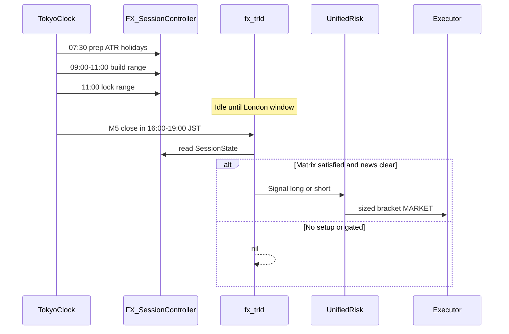
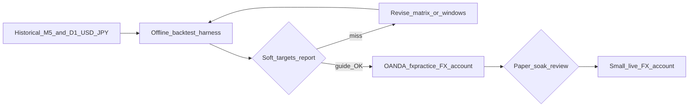

# FX USD/JPY Lane — Architecture

Design rationale for the **FX TRLD** market lane (Tokyo Range → London Drive) on
`USD_JPY`. Normative component behaviour lives in specs `15`–`19`. Where this document
and a spec disagree, **this architecture wins** and the spec should be corrected.

EU LOVE remains unchanged and independent. This lane reuses the Tradex VM hot path
(candles → session → `Analyze()` → risk → bracketed executor) with FX-specific session
timing, strategy matrix, risk profile, and **soft validation targets** (offline backtest
+ paper soak guide promotion; not a hard live blocker — decision B).

Related: [`architecture.md`](./architecture.md) (system-wide), specs under
[`specs/`](./specs/) (`15`–`19`). Current design sketch:
[Excalidraw board](https://excalidraw.com/#json=g2no1-pVrHsLa5t1qRxiJ,gZT4eCEMiPx7N_XlHGA0cA).

**Diagram key:** same as `architecture.md` — solid = sync hot path; dotted = async / RAM.

---

## 1. Locked decisions

| Decision | Choice | Why |
| --- | --- | --- |
| Platform | Extend Tradex VM hot path (new market lane) | Reuse proven money path; no Cloud Run on entry/exit |
| Instrument | `USD_JPY` (OANDA FX CFD) | Deep liquidity, clear Tokyo→London structure |
| Account | Dedicated OANDA account (isolated from EU) | Same rule as `architecture.md` §1.1 |
| Strategy | **TRLD — Tokyo Range → London Drive** (`fx_trld`) | Session-breakout family like EU LOVE; FX-timed edge |
| Validation | Paper + offline backtest as **soft targets** | Weekend gaps + BOJ/Fed risk — evidence guides promotion |

We copy the **architecture pattern** (session distiller + pure strategy + unified risk),
not EU wall-clock times.

---

## 2. Edge hypothesis (profit thesis)

USD/JPY typically consolidates in Tokyo, then expands when London (and later NY) brings
USD institutional flow. The edge is **not** “trade FX 24h”; it is:

> Trade **one confirmed break** of the Tokyo consolidation, only when London liquidity
> is live, VWAP/structure agrees, and macro risk is clear.

### Expectancy design targets (prove in backtest)

| Parameter | Target |
| --- | --- |
| Risk per trade | 1% equity |
| Initial SL | `0.4–0.6 × DailyATR` (config; default 0.5) |
| Take profit | `1.2–1.8 × DailyATR` (default 1.5 → ~1:3 R:R) |
| Breakeven | after +1R |
| Frequency | **one trade / day / instrument** (no same-day reverse flip) |
| Soft targets | expectancy &gt; 0 after costs/spread; max DD within kill-switch budget |

If soft targets fail, **revise the matrix or windows** (and document) before sizing up
live capital — do **not** loosen `18` kill-switch limits to “pass” the report.

---

## 3. Placement in Tradex

**Mapping:** `USD_JPY → FX session controller → fx_trld Analyze()`

| Layer | Shared unchanged | New / changed for FX |
| --- | --- | --- |
| Ingest | Market data, candle builder | Stream/config includes `USD_JPY` |
| Context | — | FX session controller (`16`; shared `session.Controller` + hub) |
| Decision | Strategy iface / router | `fx_trld` (`17`) |
| Risk / exec | Unified risk, executor, control plane | FX risk profile + account binding (`18`) |
| Support | Calendar, ledger, dashboard | FX/BOJ/Fed region tags; validation harness (`19`) |

---

## 4. Strategy critical path

### 4.1 Session clock (`Asia/Tokyo`)

| Phase | Wall clock | System action |
| --- | --- | --- |
| Prep | 07:30 | Daily candles → 14d ATR; holiday check |
| Range build | 09:00–11:00 | Accumulate Tokyo range high/low; seed session VWAP |
| Range lock | 11:00 | Freeze `OpeningHigh` / `OpeningLow` |
| Trade window | 16:00–19:00 | Evaluate TRLD on each M5 close (London morning) |
| Soft cutoff | 21:00 | No new entries |
| Hard flatten | Friday `16:00` `America/New_York` | Flat into weekend FX gap |
| Kill zones | ±30–60m around high-impact USD/JPY events | Block entries; BE or flatten if in trade |

**Calendar / news:** FX uses the shared economic-calendar pipeline
([`10-economic-calendar.md`](./specs/10-economic-calendar.md)) — Finnhub primary →
Gemini Live Search fallback → Telegram review → durable `calendar-state.json` (GCS /
on-VM file). Regions `US` and `JP` (with `EU`) are first-class; the VM still only reads
the durable file/GCS object (EU file provider path unchanged). Ops review Telegram;
optional manual paste backup if both providers fail:
[`data/README-calendar.md`](../data/README-calendar.md).

Defaults are config keys; all times are IANA-resolved (DST-aware).

### 4.2 Entry matrix (all must hold)

**Long**

1. `RangeLocked == true`
2. Now in trade window
3. M5 **closes fully above** Tokyo `OpeningHigh` (no wick-only)
4. Close **above** session VWAP
5. Volume &gt; `vol_spike_mult × VolMA12`
6. Range width ∈ `[min_atr_frac × ATR, max_atr_frac × ATR]`
7. Calendar gate open (no Fed/BOJ/CPI/NFP blackout)
8. No trade yet today on `USD_JPY` (enforced in risk)

**Short** — mirror below range low / below VWAP.

### 4.3 Expectancy protectors (no-trade / invalidate)

- FX weekend closed; no Sunday/Monday reopen scalps in the quiet window
- Friday: no new entries after soft rules; hard flatten before NY FX close
- BOJ intervention / extreme vol regime → pause FX lane (`PAUSE` or lock)
- Spread gate: quoted spread &gt; `max_spread_pips` → skip signal
- Single instrument in FX v1 (no EURJPY correlation group yet)

### 4.4 In-trade management

1. Bracket SL/TP at entry (survive VM death)
2. Move SL to breakeven at **+1R**
3. Trail after **+1.5R** — config; **default off** until backtested
4. News approaching: in profit → BE; underwater → flatten
5. Soft cutoff: if open with &lt;0.5R → flatten

---

## 5. Risk & account robustness

Per **FX account** (unified risk module, FX config profile):

| Control | Default |
| --- | --- |
| Risk / trade | 1% equity |
| Daily hard lock | config USD loss (sized to account) |
| Consecutive loss halt | 3 |
| One trade / day / instrument | hard |
| Kill switch | FX account lock until signed `RE_ARM` |
| Margin / leverage gate | scale down units if margin &gt; cap |

EU and FX accounts never share margin or daily P&L baselines.

---

## 6. Validation before live money

**Soft targets (decision B):** offline backtest metrics and paper soak **guide**
promotion; they are **not** a hard live blocker. Desired evidence (spec 19):

1. Replay harness using the same `MarketEvent` + `SessionState` contracts as live
2. Cost model: spread + slippage
3. Walk-forward or out-of-sample holdout
4. Event-day stress report (FOMC / BOJ weeks)

**Status:** `cmd/backtester` is EU-only today. Until the FX harness is wired, treat
paper soak on the FX `fxpractice` account as the practical validation path.

Normative soft targets: [`19-fx-validation-backtest.md`](./specs/19-fx-validation-backtest.md).

---

## 7. Spec pack

| # | Spec | Focus |
| --- | --- | --- |
| 15 | [`15-fx-usdjpy-overview.md`](./specs/15-fx-usdjpy-overview.md) | Scope, instrument, account, success metrics |
| 16 | [`16-fx-session-controller.md`](./specs/16-fx-session-controller.md) | Tokyo range, ATR, VWAP, windows |
| 17 | [`17-strategy-fx-trld.md`](./specs/17-strategy-fx-trld.md) | **Profit core** — matrices, filters, signal |
| 18 | [`18-fx-risk-profile.md`](./specs/18-fx-risk-profile.md) | Sizing, gates, weekend/news vs EU |
| 19 | [`19-fx-validation-backtest.md`](./specs/19-fx-validation-backtest.md) | Soft-target harness design + promotion guidance |

Write/read order for implementers: **17 → 16 → 18 → 19**, with 15 as the lane charter.

---

## 8. Non-goals (this lane)

- Crypto / weekend trading
- Discretionary overlay in the bot
- Multi-pair FX book (USD_JPY only)
- Changing EU LOVE behaviour
- Cloud Run on the money path
